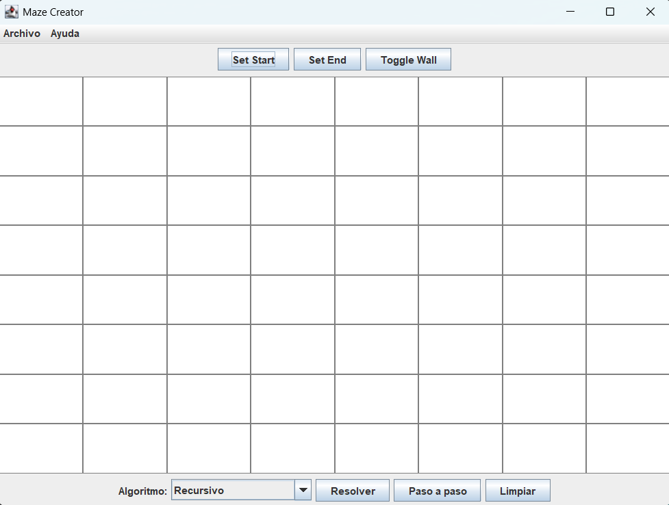
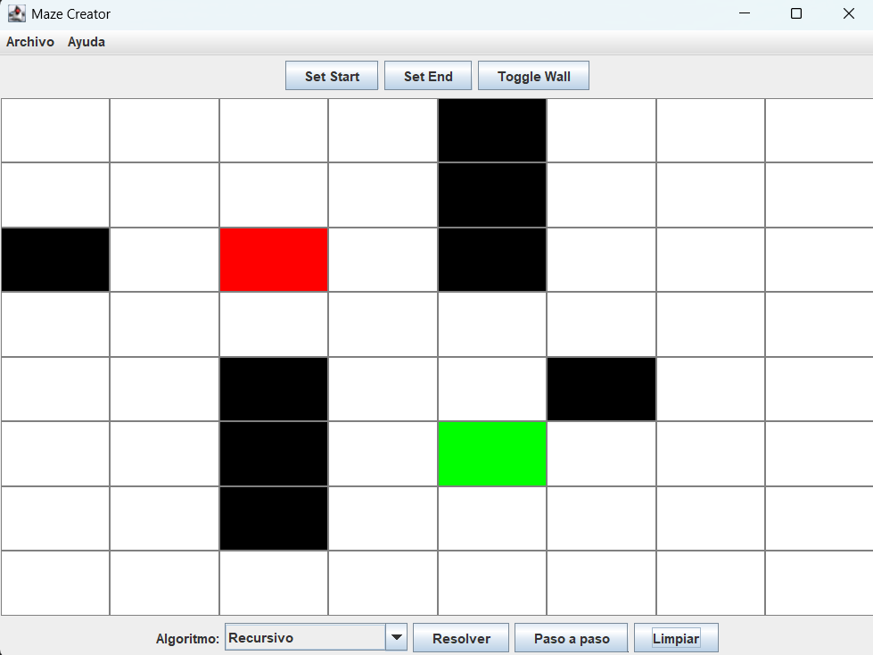
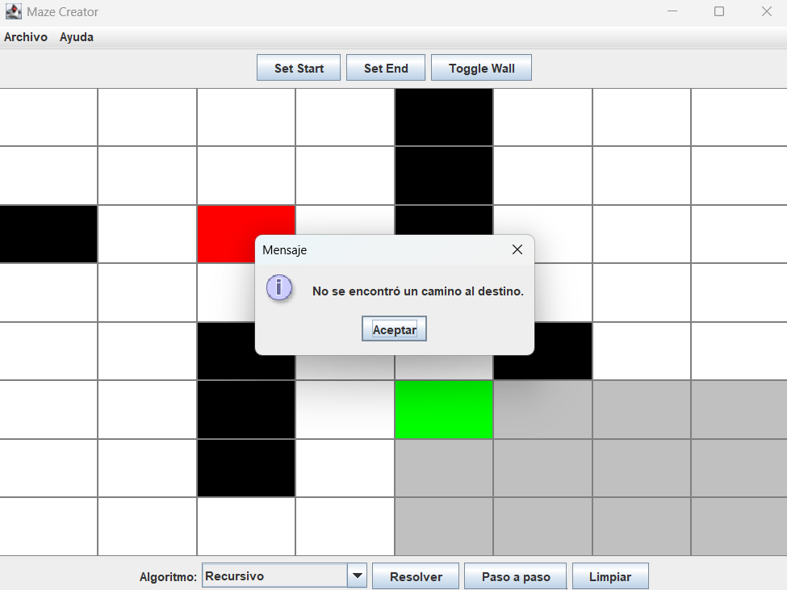
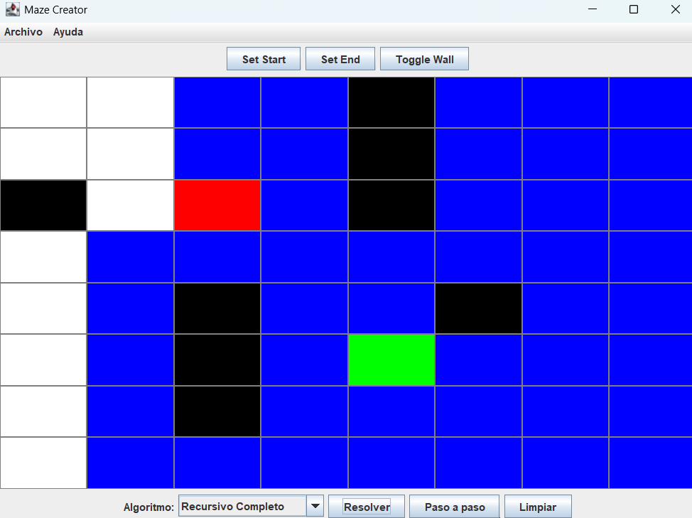
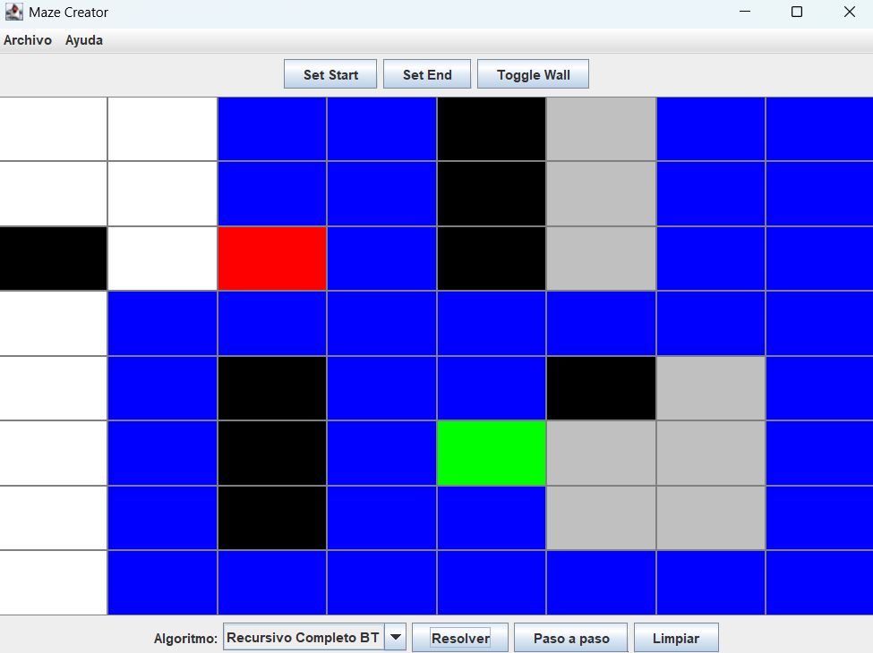
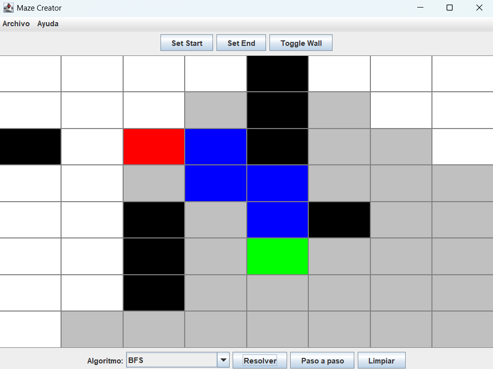
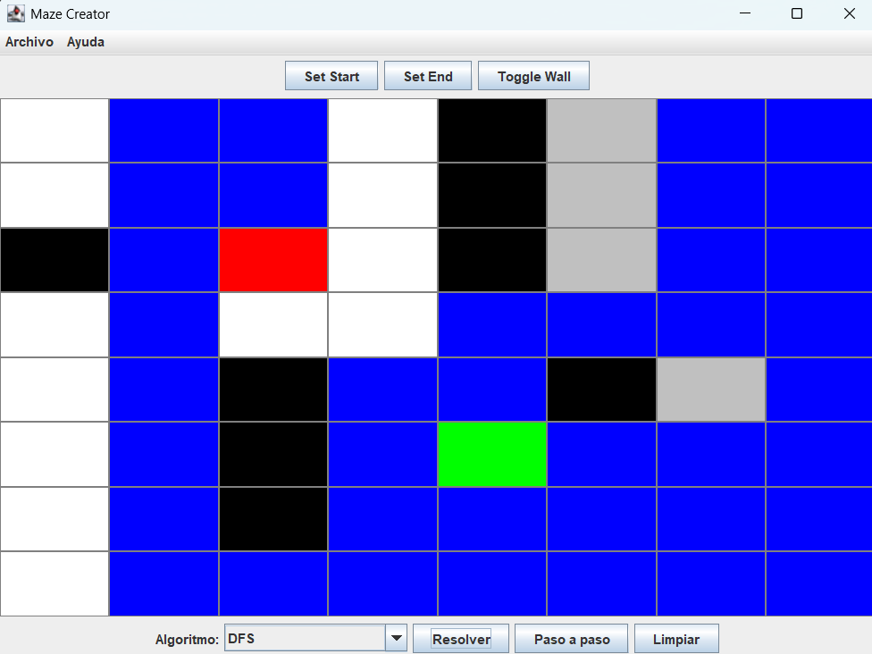
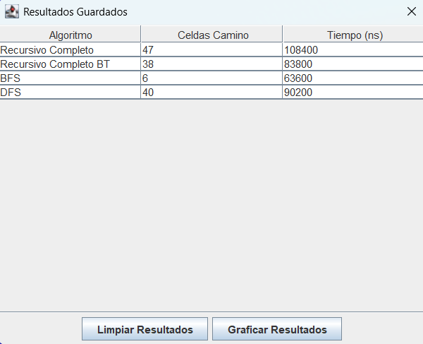
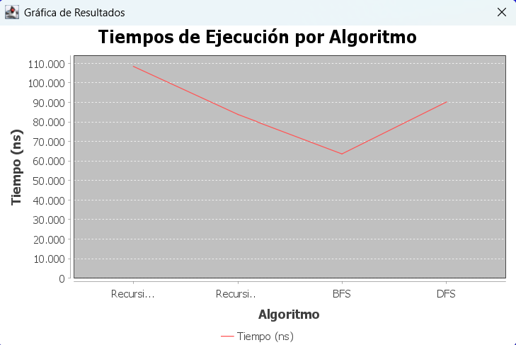

# Proyecto Final: *Laberinto*

## 📌 Información General

- **Título:** Proyecto Final  
- **Asignatura:** Estructura de Datos  
- **Carrera:** Computación  
- **Estudiante:** Carlos Antonio Gordillo Tenemaza  
- **Correo:** [cgordillot@est.ups.edu.ec](mailto:cgordillot@est.ups.edu.ec)  
- **Fecha:** 28/07/2025  
- **Profesor:** Ing. Pablo Torres

---

## 📖 Descripción del Problema

El proyecto consiste en la simulación de un laberinto representado por una matriz. El objetivo es encontrar un camino desde una celda de inicio hasta una celda de destino, esquivando obstáculos. Para ello, se implementan varios algoritmos de búsqueda que resuelven el laberinto y visualizan el proceso paso a paso o automáticamente. Se incluyen opciones para guardar resultados y analizarlos gráficamente.

---

## 🎯 Objetivos

### Objetivo General:
- Desarrollar una aplicación en Java utilizando estructuras de datos y algoritmos de búsqueda para simular la resolución de laberintos.

### Objetivos Específicos:
- Implementar algoritmos de búsqueda como BFS, DFS y Recursivos.
- Aplicar el patrón de diseño Modelo-Vista-Controlador (MVC).
- Visualizar gráficamente la ejecución de los algoritmos.
- Registrar resultados en archivos y mostrar estadísticas mediante gráficos.

---

## 🧠 Marco Teórico

### Algoritmos Utilizados:

- **Búsqueda en Anchura (BFS):** Recorre por niveles utilizando una cola, ideal para encontrar el camino más corto.
- **Búsqueda en Profundidad (DFS):** Explora lo más profundo posible antes de retroceder, usando una pila.
- **Recursivo:** Método simple que explora hacia la derecha y abajo únicamente.
- **Recursivo Completo:** Recorre todas las direcciones posibles (abajo, derecha, arriba, izquierda) hasta encontrar el destino.
- **Recursivo Completo BT:** Similar al anterior pero aplicando *backtracking* visual (desmarca caminos erróneos).

---

## 💡 Propuesta de Solución

El proyecto se estructura siguiendo el patrón **MVC**:

- **Modelo:**
  - `Cell`: Representa cada celda del laberinto.
  - `CellState`: Enum para definir el estado (vacio, muro, inicio, fin, camino).
  - `SolveResults`: Contiene las listas de celdas visitadas y el camino hallado.
  - `AlgorithmResult`: Estructura para guardar estadísticas de ejecución.

- **Vista:**
  - `MazeFrame`: Ventana principal con controles, menú y visualización del laberinto.
  - `MazePanel`: Genera la matriz de botones.
  - `ResultadosDialog`: Muestra resultados en tabla y permite graficarlos.

- **Controlador:**
  - `MazeController`: Coordina la interacción entre vista y modelo.
  
- **DAO:**
  - `AlgorithmResultDAO` y `AlgorithmResultDAOFile`: Persistencia en CSV.

- **Algoritmos (`solver.solverImpl`):**
  - BFS, DFS, Recursivo, RecursivoCompleto, RecursivoCompletoBT.

---

## 🖥️ Desarrollo Técnico

- **Lenguaje:** Java  
- **IDE usado:** Visual Studio Code  
- **Librerías:**  
  - `javax.swing` para interfaces gráficas  
  - `java.util` para estructuras de datos  
  - `org.jfree.chart` para gráficos  
- **Entrada del usuario:**  
  - Número de filas y columnas del laberinto  
  - Selección del algoritmo  
  - Paso a paso o resolución automática  
- **Persistencia:**  
  - Archivo `results.csv` donde se guardan los resultados de cada ejecución.

---

## 🧪 Resultados

### Simulaciones realizadas:
- Laberintos resueltos con diferentes algoritmos.
- Pruebas exitosas de búsqueda cuando hay o no hay camino.
- Visualización animada de caminos y pasos visitados.

### 💻 Interfaz Gráfica:

> *Figura 1: La pantalla principal del laberinto generado.*

> *Figura 2: Selección de celdas de inicio, fin o muros.*

> *Figura 3: Algoritmo Recursivo*

> *Figura 4: Algoritmo Recursivo Completo*

> *Figura 5: Algoritmo Recursivo Completo BT*

> *Figura 6: Algoritmo BTS*

> *Figura 7: Algoritmo DFS*

### 📊 Gráficos:

> *Tabla 1: Comparación del tiempo de ejecución y celdas recorridas de cada algoritmo*

> *Figura 8: Los resultados de los algoritmos (estadísticas)*

### 👤 Rol del Estudiante

- Asumió la responsabilidad total del desarrollo del proyecto: diseño de la interfaz gráfica, implementación de los algoritmos de búsqueda, aplicación del patrón Modelo-Vista-Controlador (MVC) y persistencia de resultados. 

- Verificó el correcto funcionamiento de los algoritmos **Recursivo**, **Recursivo Completo**, **Recursivo Completo BT**, **BFS** y **DFS**, así como la visualización animada del recorrido.  

- Uno de los principales desafíos fue lograr que el algoritmo **Recursivo Completo** pintara correctamente todos los caminos posibles sin recorrer direcciones innecesarias, lo cual se resolvió respetando la lógica implementada por el docente. 

- Se incorporó una validación para mostrar un mensaje cuando no se encuentra un camino posible, lo cual mejora la experiencia del usuario. 

- Se desarrolló una interfaz intuitiva y visualmente clara que permite una interacción directa con el laberinto (establecer inicio, fin, muros y reinicio).

---

### ✅ Conclusión

Durante la implementación de los algoritmos de búsqueda, se evidenciaron los siguientes resultados:

- **Recursivo:** Simple y funcional, aunque limitado a recorrer únicamente hacia abajo y derecha.
- **Recursivo Completo:** Recorre todas las rutas posibles siguiendo una lógica optimizada basada en la ubicación del destino.
- **Recursivo Completo BT:** Similar al anterior, pero incluye *backtracking* para deshacer caminos erróneos.
- **BFS (Anchura):** Eficiente para encontrar la ruta más corta.
- **DFS (Profundidad):** Útil en ciertos escenarios, pero puede explorar caminos largos innecesariamente.

---

### ⚠️ Consideraciones Finales

- Se aplicó correctamente la lógica del algoritmo Recursivo Completo propuesta por el docente, donde solo se exploran las direcciones necesarias según la ubicación del destino.
- Se resolvió un error que impedía mostrar el mensaje “No se encontró un camino” cuando no existía solución.
- Se mantuvo una organización clara en el código gracias al patrón MVC.
- La visualización gráfica facilita enormemente el entendimiento del funcionamiento interno de cada algoritmo.
- Como mejora futura, se puede permitir guardar y cargar laberintos personalizados para pruebas repetidas.
